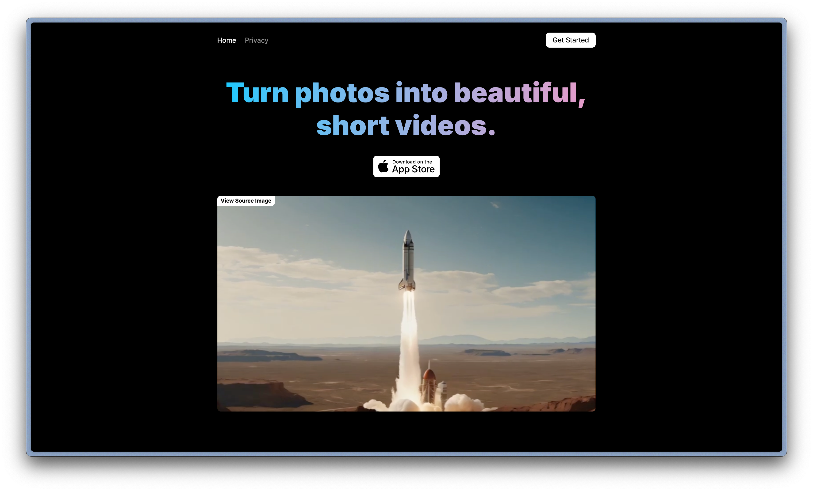
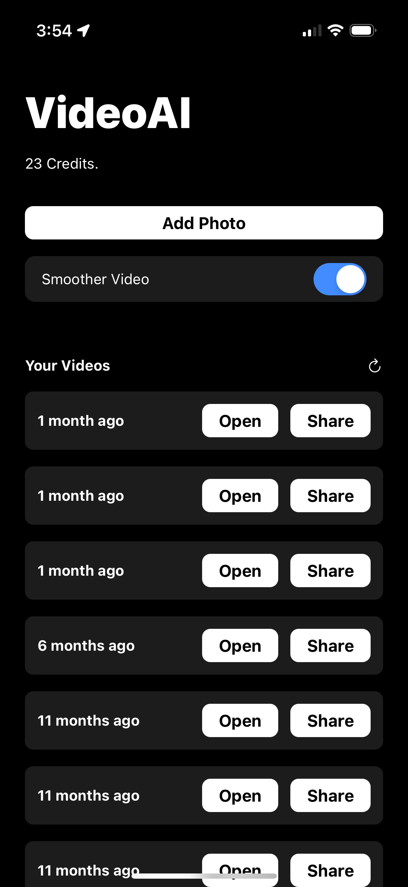
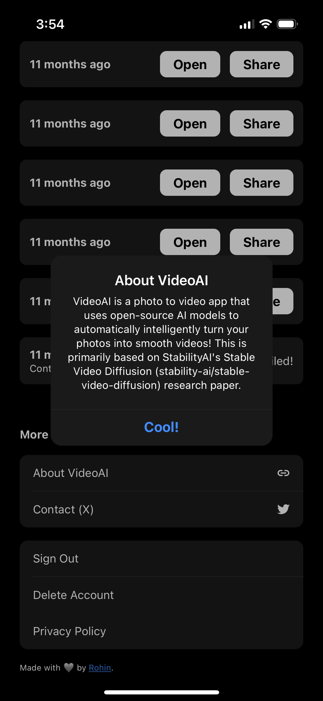

# VideoAI

Capacitor-based iOS app that leverages StabilityAI's first photo-to-video research model to create videos from your photos. This was published on the App Store throughout 2023 and 2024. It was written in JavaScript using the Capacitor framework!

Here are a couple screenshots:

